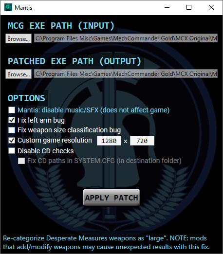

# Mantis

A simple patcher to automate a few fixes for MechCommander Gold that otherwise require e.g., hex editing. It reads in the MechCommander Gold exe and saves a patched copy of it.

As an era-appropriate display of whimsy, Mantis uses music and SFX from the game.

_(I was going to call it "Lynx", but a lot of software is apparently called Lynx already; "Beast" and "Hunter" sound too aggressive; "Vixen" has undesired undertones.)_

## Patching options

Mantis includes patch options for the following changes:

- Fix the distribution of "large" weapons to be across a mech's arms and side torsos instead of on just its left arm, as explained [here](https://mhloppy.com/2026/05/mechcommander-weapons-left-arm-bug-fix/).
- Fix the size classification of Desperate Measures weapons, as explained [here](https://mhloppy.com/2026/05/mechcommander-weapons-left-arm-bug-fix/).
- Customize in-game render resolution (which does not affect menus or the logistics phase), as explained [here](https://mhloppy.com/2026/04/mechcommander-windows-10-without-crashes/).
- Disable CD checks to allow the game to be run without needing a physical disc or mounted disc image.

For convenience, it also includes the ability to set CD paths in the SYSTEM.CFG file to local non-disc data files, as this can otherwise cause issues if disabling the CD checks.

## Version compatibility

Mantis has been designed around and tested on the _unpatched_ English MechCommander Gold exe (the same version hosted on ModDB and MyAbandonware).

## Download

Download the latest release [here](https://github.com/MHLoppy/Mantis/releases).

Mantis targets 64-bit Windows systems and requires .NET 8 or higher to run. If not already installed, you may be prompted to install .NET when first running Mantis.

## Credits

- The left arm and weapon size classification fixes only exist because of [Vana's](https://mhloppy.com/2026/03/mechcommander-commando-uller-movement-speed/#comments) [comments](https://mhloppy.com/2026/04/mechcommander-lbx-ac-autocannon-damage/#comments) giving me a brain worm.
- Render resolution changes are based on the work of [RizZen and magic (AKA magicX)](https://www.moddb.com/mods/mechcommander-gold-hi-res/tutorials/mc-beginners-guide-resolution-notes).
- The CD check patching option builds on the work of [MechCommander No-CD Patcher](https://github.com/Corben-SpacedOut/MechCommanderNoCDPatcher) by Corben-SpacedOut / jarno-r.

## License

Code licensed under the Baba Yaga license.

Since I don't own the rights to MechCommander assets, I am criminal scum for using them and am unable to license reuse of these assets by others. Consider other documentation and assets to be licensed under your choice of Baba Yaga or [CC BY-SA 4.0](https://creativecommons.org/licenses/by-sa/4.0/) if needed.